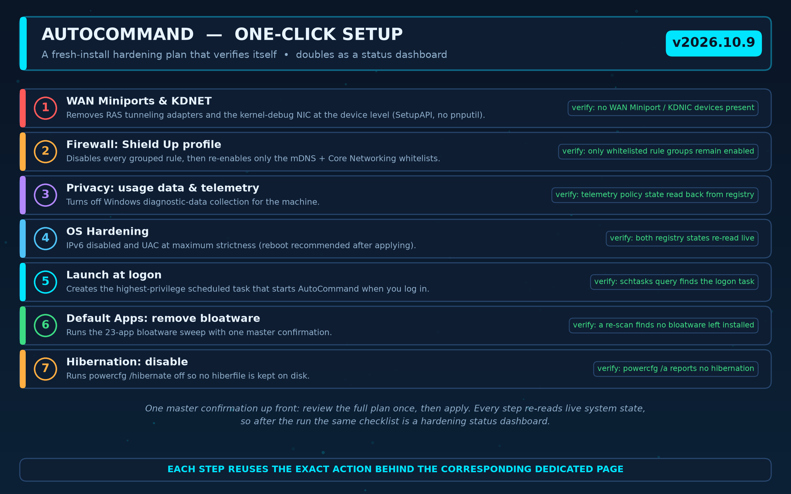
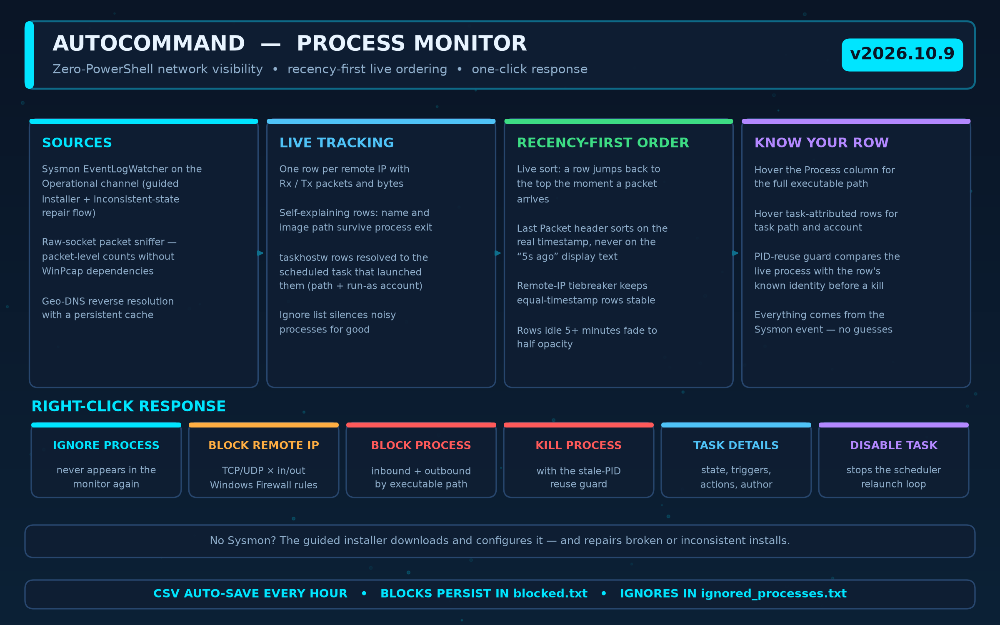
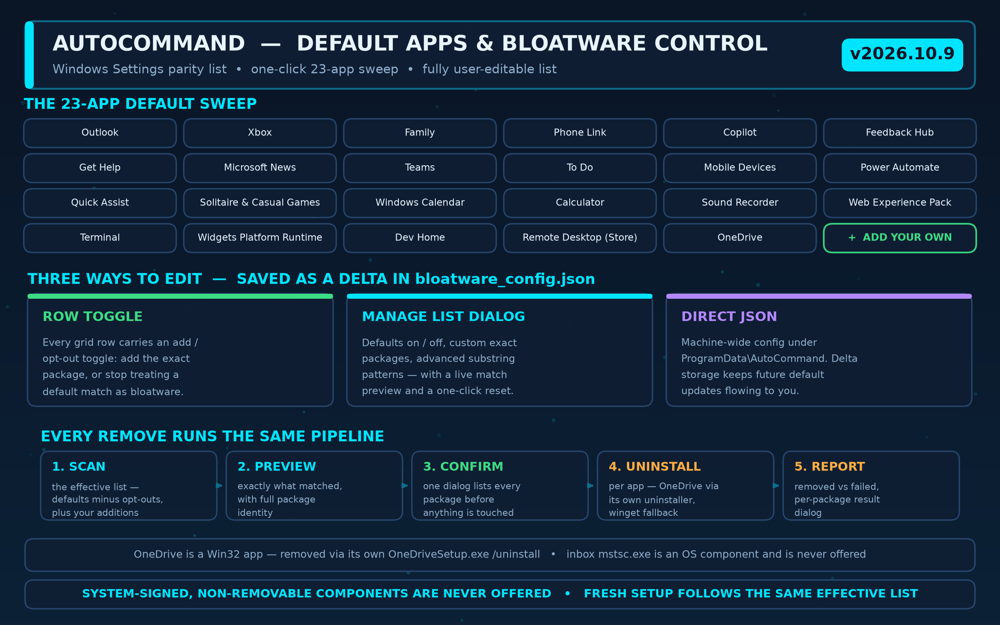
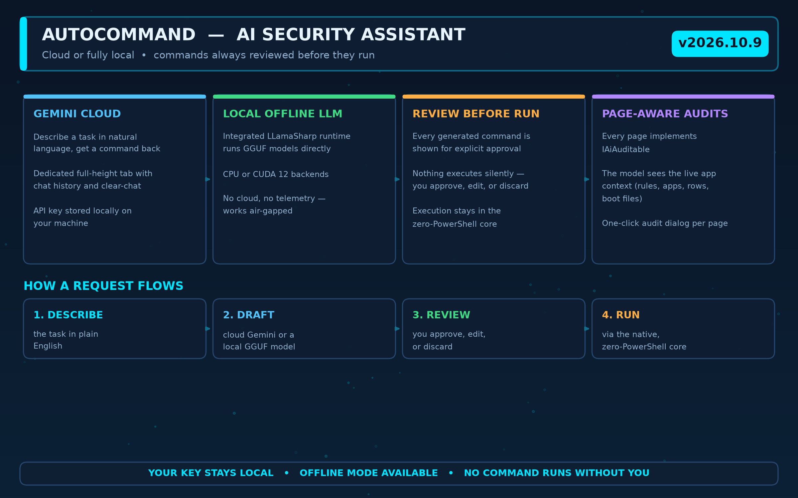
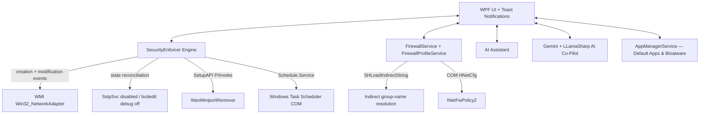

# AutoCommand — Windows Security & Hardening Suite


**AutoCommand** is an enterprise-grade C# WPF security and OS hardening suite for Windows 10 and 11. It delivers zero-PowerShell threat monitoring, self-healing network-adapter defense, native COM firewall management with one-click profiles, UEFI/Secure Boot integrity checks, a 23-app bloatware sweep with a user-editable list, and an integrated AI command assistant — all from a single administrator dashboard.

> **⬇ Download:** grab the latest self-contained build from the [Releases page](https://github.com/dparksports/autocommand-windows/releases) — no .NET installation required.

---

## 🆕 What's New in v2026.10.9

* **🧹 23-app bloatware sweep** — Remove Bloatware grew from 4 patterns to 23 preinstalled apps, and **OneDrive** (a Win32 app, invisible to the package manager) is now uninstalled through its own `OneDriveSetup.exe /uninstall` with a winget fallback.
* **⚙ Your bloatware list, your rules** — every app row carries a one-click toggle, and a new **Manage List** dialog edits the full set (defaults on/off, custom exact packages, custom substring patterns with a live match preview, reset). Edits persist as a delta in `C:\ProgramData\AutoCommand\bloatware_config.json`, so defaults shipped in future updates still arrive.
* **⏱ Process Monitor sorts by true recency** — the connections grid live-sorts most-recent-packet-first (a row jumps to the top the moment traffic arrives), header clicks sort the real timestamp instead of the "5s ago" text, and rows idle 5+ minutes fade out.

Full history on the [Releases page](https://github.com/dparksports/autocommand-windows/releases).

---

## 🖥 The Suite at a Glance


Eight modules, one dashboard:

| Module | What it does |
|---|---|
| **One-Click Setup** | 7-step fresh-install hardening plan that verifies every step against live system state |
| **Advanced Firewall** | Five one-click profiles, per-rule overrides, drift detection — via native COM |
| **Security Enforcer** | Event-driven SSTP / kernel-debug guard with a self-healing reconciliation sweep |
| **Process Monitor** | Sysmon + raw-socket visibility, Geo-DNS, one-click block / kill / task control |
| **Default Apps & Bloatware** | Windows Settings parity list, one-click sweep, fully user-editable list |
| **UEFI & Secure Boot** | DBX updates, EFI integrity baselines, signature-verified tool downloads |
| **AI Assistant** | Gemini cloud or local GGUF models — every command reviewed before it runs |
| **OS Hardening** | LSA protection, UAC enforcement, telemetry off, hibernation and WiFi Direct toggles |

---

## ⚡ One-Click Setup

A fresh-install hardening plan on a single page. Review the master confirmation once, apply, and every step re-reads live system state — so the same checklist doubles as a hardening status dashboard.



Each step reuses the exact action behind the corresponding dedicated page (Command Panel, Firewall, Privacy, OS Hardening, Default Apps) — nothing is a second, divergent implementation.

---

## 🛡 Advanced Firewall Management

The **Advanced Firewall Settings** page gives you full read/write access to Windows Defender Firewall without a single line of PowerShell.

| Profile | What it does | Intended for |
|---|---|---|
| **Shield Up** | Disables every grouped rule, then re-enables only the whitelists (`mDNS`, `Core Networking`) | Suspected compromise, full lockdown |
| **Public Strict** | Disables File & Printer Sharing, Network Discovery, Remote Desktop | Public Wi-Fi, travel |
| **Gaming** | Enables Network Discovery, Cast to Device functionality | Gaming / streaming on a trusted LAN |
| **Office** | Enables File & Printer Sharing, Network Discovery, Remote Desktop | Office workstation on a LAN |
| **Home** | Enables File & Printer Sharing, Network Discovery | Trusted home network |


**How a profile applies:** **enumerate** every rule through `INetFwPolicy2` COM → **resolve** indirect group strings (`SHLoadIndirectString`) → **match** case-insensitively against raw and resolved names → **apply** with a live per-group progress bar → **report** matched / changed / failed rules with the first error, if any.

---

## 🌐 Process Monitor & Network Analytics

Live, packet-level visibility into who is talking to whom — and one-click ways to make it stop.



* **Sysmon Integration** — native monitoring of `Microsoft-Windows-Sysmon/Operational` via `EventLogWatcher`, plus an installer service with guided repair for inconsistent installs.
* **Raw Socket Sniffer** — per-connection Rx/Tx packet and byte counts without WinPcap dependencies.
* **Active Connections & Geo-DNS** — live remote IPs with reverse-resolved domain names and a persistent DNS cache.
* **Self-explaining rows** — process name and full image path come straight from the Sysmon event, so rows keep their identity even after the process exits.
* **Scheduled-task attribution** — taskhostw rows resolve to the scheduled task that launched them (task-instance GUID correlated with Task Scheduler history, auto-enabled once if off). Hover for path and run-as account; open **Scheduled task details**; **Disable this scheduled task** stops the relaunch loop for good.
* **Recency-first live ordering** — the grid keeps itself sorted most-recent-packet-first; a row jumps to the top the moment new traffic arrives, equal timestamps keep a stable order, and rows silent for 5+ minutes fade to half opacity.
* **One-click response** — ignore a process, block its remote IP (TCP/UDP × inbound/outbound), block the whole executable, or kill it (with a PID-reuse guard that warns on stale rows).
* **SVCHOST Monitor** — per-service breakdown of the generic host processes.

---

## 📦 Default Apps & Bloatware Control

The app list mirrors the Store-packaged portion of *Windows Settings → Installed apps* — frameworks, resource bundles, and System-signed OS components are hidden (an opt-in toggle reveals the latter). Signature status is read from the package's deployment-validated `SignatureKind` with the signer's CN from the publisher.



* **Remove Bloatware** — one click scans the effective list, confirms the exact matches with you, uninstalls each app, and reports per-app results.
* **The default sweep covers 23 apps** — Outlook, Xbox, Family, Phone Link, Copilot, Feedback Hub, Get Help, Microsoft News, Teams, To Do, Mobile Devices (Cross-Device Host), Power Automate, Quick Assist, Solitaire & Casual Games, Windows Calendar, Calculator, Sound Recorder, Web Experience Pack, Terminal, Widgets Platform Runtime, Dev Home (including the retired 0.0.0 stub), the Remote Desktop Store client, and OneDrive.
* **OneDrive is a Win32 app**, not a Store package — it is detected via its install directory and uninstall registry entry and removed through its own `OneDriveSetup.exe /uninstall` (winget fallback).
* **The inbox Remote Desktop Connection** (`mstsc.exe`) is an OS component, not a package — it is deliberately never offered for deletion. System-signed, non-removable components are always excluded.
* **Your list, your rules** — toggle any row in the grid, or use **Manage List** to flip the 23 defaults on/off, add exact package names, or add advanced substring patterns with a live match preview. Everything persists as a delta in `C:\ProgramData\AutoCommand\bloatware_config.json` (machine-wide), so app updates keep delivering new defaults — and Fresh Setup's bloatware step and its verification follow the same effective list.

---

## 🤖 AI Security Assistant



* **Two engines** — the Gemini cloud assistant, or a fully local offline LLM via an integrated `LLamaSharp` runtime running GGUF models on CPU or CUDA 12.
* **Review before run** — generated commands are shown for explicit approval; nothing executes silently.
* **Page-aware audits** — every page implements `IAiAuditable`, so the model can reason over the live app context (firewall rules, app packages, boot files, connection rows).

---

## 🚨 Event-Driven Security Enforcer

* **SSTP & WAN Miniport Guard** — detects unauthorized Remote Access Service tunneling interfaces instantly.
* **Kernel Debug Adapter Block** — intercepts active `KDNIC` / kernel-debug network adapters used for remote OS debugging.
* **Creation + Modification Watchers** — device *arrival* and device *re-enable* events are both caught, so nothing sneaks back in as a modification.
* **State Reconciliation Sweep** — every few seconds the enforcer re-asserts the desired state: SstpSvc stopped **and** disabled (`Start=4`), kernel debug off in the BCD, no working KDNIC adapter. Drift is neutralized automatically or raises a reviewable alert (configurable cadence, persisted across restarts).
* **Privileged Task Scanner** — enumerates non-Microsoft scheduled tasks running with `TASK_RUNLEVEL_HIGHEST` privileges.
* **Hosts File Guard** — real-time detection of malicious DNS redirects outside `localhost` / `127.0.0.1`.
* **Action Center Toast Alerts** — native Windows 10/11 toasts bring AutoCommand to the foreground on click.
* **Auto-Mitigation Toggle** — automatic background takedowns or interactive review prompts (Block, Whitelist, Ignore). Whitelists and preferences persist across reboots.

---

## 🔐 UEFI & Secure Boot Integrity

The **DBX Safety** page protects the earliest link in the boot chain:

* **EFI Integrity Baseline** — hashes every `.efi` module on the EFI System Partition and reports drift against a stored baseline.
* **Bootloader Signature Check** — verifies `bootmgfw.efi` with Sysinternals sigcheck (output decoded correctly — Sysinternals tools stream UTF-16LE when redirected), including its `Verified:` verdict and publisher.
* **Verified Tool Downloads** — sigcheck is auto-downloaded from Sysinternals Live **only after** passing two integrity gates: its SHA256 is logged for audit, and the binary must carry a valid Microsoft Authenticode signature (`WinVerifyTrust`). Anything else is deleted, never executed.
* **DBX Update Pipeline** — downloads the latest `DBXUpdate.bin` from Microsoft's secureboot_objects repository, parses the `EFI_SIGNATURE_LIST` structure, and applies it to firmware via `Set-SecureBootUEFI` after an explicit critical warning.
* **Boot Repair** — one-click `bcdboot` repair path for corrupted boot files.

---

## 🧰 OS Hardening & Extras

* **Hardening Toggles** — quick controls for LSA Protection, UAC enforcement, telemetry, WiFi Direct, and hibernation.
* **SetupAPI Device Takedown** — direct P/Invoke `SetupAPI` routines (`WanMiniportRemover.cs`) for clean kernel-mode adapter removal — no `pnputil` CLI.
* **Event-Driven Adapter Defense** — native `__InstanceCreationEvent` / `__InstanceDeletionEvent` / `__InstanceModificationEvent` subscriptions with zero idle CPU cost.
* **Firewall Baseline & Drift Detection** — capture the expected enabled/disabled state of *every* rule after applying a profile, then detect drift when Windows Update or a reboot silently re-enables rules or provisions new ones.
* **Plugin System** — extend AutoCommand through the bundled `AutoCommand.Sdk` plugin loader.
* **Startup & Tasks Managers** — inspect and control persistence points.
* **Telemetry Dashboards** — opt-in Firebase-backed usage analytics with local sanitization.

---

## 🏗 Architecture



AutoCommand uses a **Zero-PowerShell Core** architecture. All monitoring and mitigation features interact directly with Windows C/C++ subsystem APIs, WMI COM interfaces, and P/Invoke DLLs (`iphlpapi.dll`, `setupapi.dll`, `shlwapi.dll`, `wintrust.dll`), eliminating overhead and avoiding script execution policies.

### Project layout

```
Views/      WPF pages (Firewall, AI Assistant, Default Apps, Process Monitor, …)
Services/   COM / WMI engines (FirewallService, SecurityEnforcer, AppManagerService, …)
Helpers/    Native helpers (ProcessRunner, AuthenticodeVerifier, BloatwareConfig, …)
Models/     Shared data models
Sdk/        AutoCommand.Sdk plugin SDK
Assets/     README infographics + generator script
```

---

## 📋 System Requirements

* **OS**: Windows 10 (v2004+) or Windows 11
* **Runtime**: none for the release build (self-contained); .NET 10 SDK to build from source
* **Privileges**: Administrator rights (required for WMI events, SetupAPI device removal, COM firewall configuration, and UEFI variable writes)

---

## 🔨 Build & Run

```powershell
# Clone repository
git clone https://github.com/dparksports/autocommand-windows.git
cd autocommand-windows

# Build (Release)
dotnet build --configuration Release

# Launch with Administrator privileges
Start-Process -FilePath "bin\Release\net10.0-windows10.0.19041.0\AutoCommand.exe" -Verb RunAs
```

Optional — build a self-contained release package (Linux `.so` libraries are stripped automatically):

```powershell
dotnet publish -c Release -r win-x64 --self-contained true
```

Optional — regenerate the README infographics (requires Python 3.10+ with `matplotlib` and `numpy`):

```powershell
py Assets/generate_infographics.py
```

---

## ⚠️ Responsible Use

AutoCommand modifies live Windows Firewall rules, services, boot configuration, and UEFI Secure Boot variables. Use it only on machines you own or are authorized to administer, and understand what each profile does before applying it — **Shield Up** in particular disables most of the rule set by design.

---

## 📄 License

Licensed under the [Apache License, Version 2.0](LICENSE).
