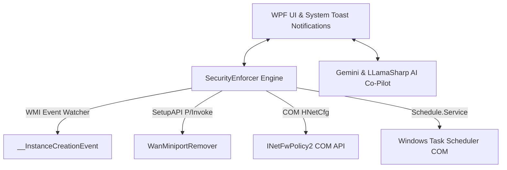

# AutoCommand v3.5 🛡️


**AutoCommand** is an enterprise-grade C# WPF security and OS hardening suite designed for Windows 10 and 11. It delivers zero-dependency threat monitoring, native SetupAPI/COM device management, event-driven network adapter protection, and an integrated conversational AI co-pilot.

---

## 🚀 What's New in v3.5

* **📡 Event-Driven Network Adapter Defense**: Replaced periodic polling with native WMI event subscriptions (`__InstanceCreationEvent` / `__InstanceDeletionEvent`). Fired instantly when unauthorized SSTP or Kernel Debug adapters appear with zero idle CPU cost.
* **🔔 Windows Action Center Toast Notifications**: System security alerts now trigger native Windows 10/11 Toast Notifications (`Windows.UI.Notifications`). Click any alert to bring AutoCommand directly to the foreground, even when minimized.
* **⚙️ User-Controlled Auto-Mitigation Toggle**: Added a dedicated **Auto-Mitigate** setting. Choose between automatic background takedowns or interactive review prompts (Block, Whitelist, or Ignore).
* **⚡ Native SetupAPI Device Takedown**: Device removal upgraded from `pnputil` CLI calls to direct P/Invoke `SetupAPI` routines (`WanMiniportRemover.cs`) for clean, reliable kernel-mode adapter uninstallation.
* **💾 Persistent Preference Memory**: SSTP and Kernel Debug adapter whitelists and auto-mitigate preferences automatically persist across system reboots.

---

## 🛡️ Core Capabilities

### ⚡ Event-Driven Security Enforcer
* **SSTP & WAN Miniport Guard**: Detects unauthorized Remote Access Service (RAS) tunneling interfaces instantly.
* **Kernel Debug Adapter Block**: Intercepts active `KDNIC` / Kernel Debug Network Adapters used for remote OS debugging.
* **Privileged Task Scanner**: Enumerate non-Microsoft scheduled tasks running with `TASK_RUNLEVEL_HIGHEST` privileges.
* **Hosts File Guard**: Real-time detection of malicious DNS redirects outside `localhost` / `127.0.0.1`.

### 🧠 AI Security Co-Pilot
* **Gemini Cloud Assistant**: Natural-language chat interface in the Command Panel to audit configurations and safely execute system tasks.
* **Local Offline LLM**: Integrated `LLamaSharp` runtime capable of running GGUF models directly on CPU or CUDA without cloud connectivity.

### 🌐 System & Process Analytics
* **Sysmon & Sockets Monitor**: Native integration with `Microsoft-Windows-Sysmon/Operational` via `EventLogWatcher` and raw sockets.
* **Active Connections & Geo-DNS**: Live display of remote IP connections, process bindings, and reverse-resolved domain names.
* **1-Click Firewall Rules**: Instantly block inbound and outbound executable traffic via native `INetFwPolicy2` COM interfaces.

### 🔒 OS Hardening & UEFI Integrity
* **DBX Firmware Safety Check**: Authenticode validation and UEFI DBX revocation checks on system bootloaders.
* **System Hardening Toggles**: Quick controls for LSA Protection, UAC enforcement, Telemetry, and WiFi Direct.

---

## 🏗️ Architecture



AutoCommand uses a **Zero-PowerShell Core** architecture. All monitoring and mitigation features interact directly with Windows C/C++ subsystem APIs, WMI COM interfaces, and P/Invoke DLLs (`iphlpapi.dll`, `setupapi.dll`), eliminating overhead and avoiding script execution policies.

---

## 📋 System Requirements

* **OS**: Windows 10 (v2004+) or Windows 11
* **Runtime**: .NET 10 SDK (or self-contained deployment)
* **Privileges**: Administrator Rights (required for WMI events, SetupAPI device removal, and COM firewall configuration)

---

## 🔧 Build & Run

```powershell
# Clone repository
git clone https://github.com/dparksports/AutoCommand.git
cd AutoCommand

# Build project
dotnet build --configuration Release

# Launch with Administrator privileges
Start-Process -FilePath "bin\Release\net10.0-windows10.0.19041.0\AutoCommand.exe" -Verb RunAs
```

---

## 📄 License

Licensed under the [Apache License, Version 2.0](LICENSE).
