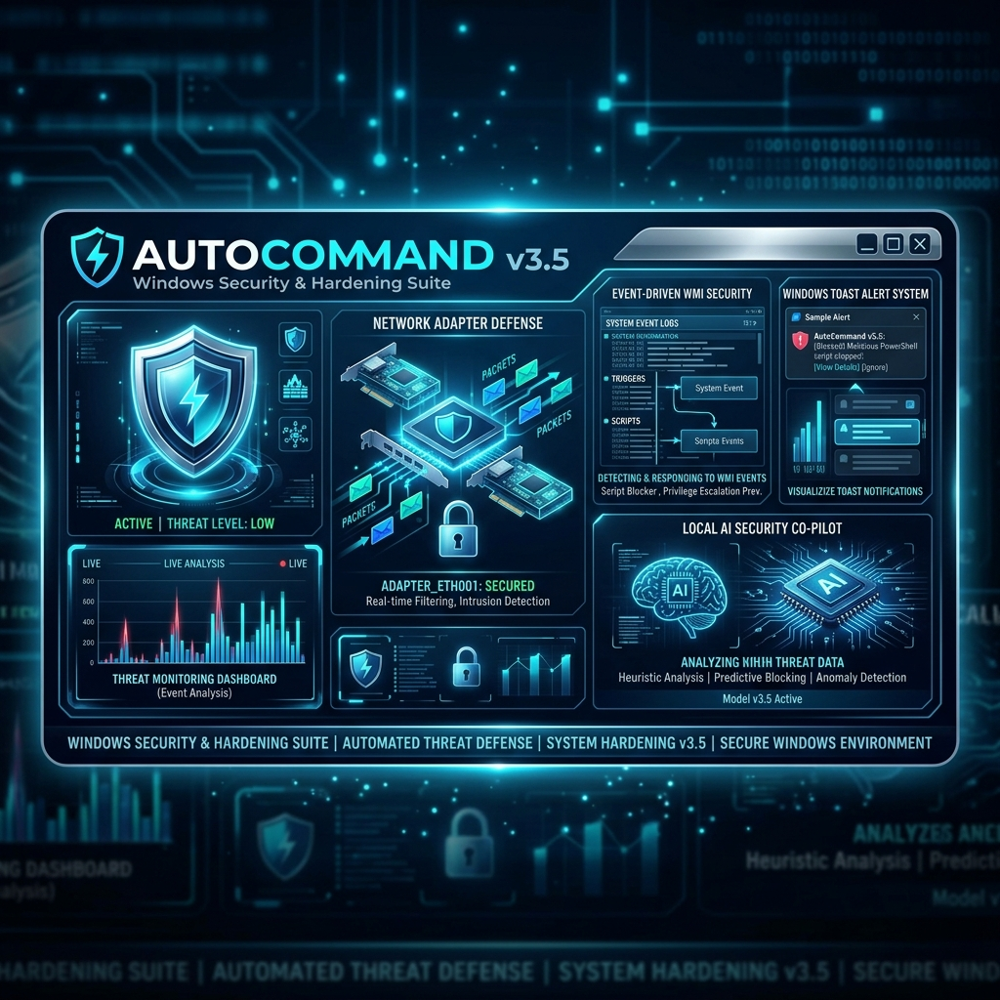
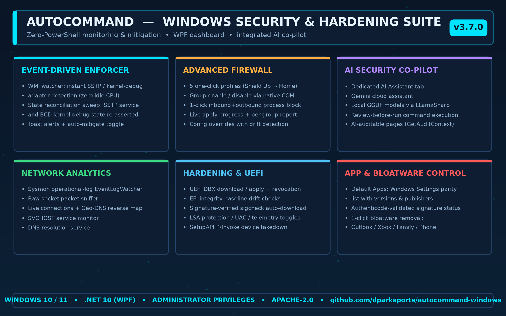
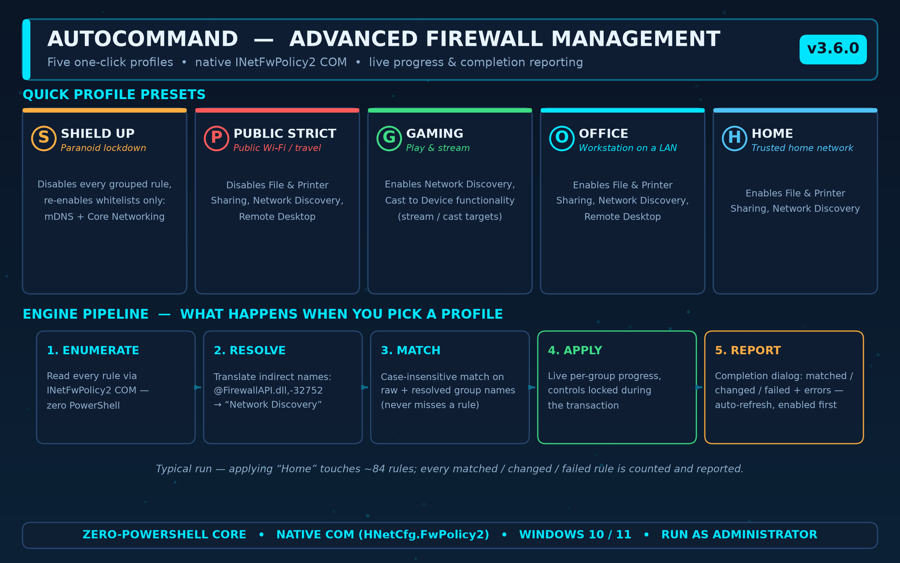
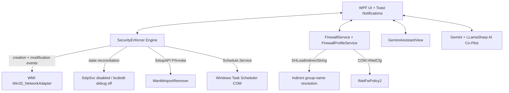

# AutoCommand v3.8.0 🛡️



**AutoCommand** is an enterprise-grade C# WPF security and OS hardening suite for Windows 10 and 11. It delivers zero-PowerShell threat monitoring, self-healing network-adapter defense, native COM firewall management with one-click profiles, UEFI/Secure Boot integrity checks, and an integrated AI command assistant — all from a single administrator dashboard.

> **📥 Download:** grab the latest self-contained build from the [Releases page](https://github.com/dparksports/autocommand-windows/releases) — no .NET installation required.

---

## 🆕 What's New in v3.8.0

* **🛠️ Guided Sysmon Repair** — when Sysmon is stuck in an inconsistent install state (leftovers of a failed install — a stale event-manifest registration and/or a stray `Sysmon64.exe` — that make every install attempt abort with *"Event manifest installation failed"*), Setup now detects it, **offers a repair and asks before touching anything**, removes the leftovers, reinstalls, and — if Windows still holds the stale registration — **asks before restarting** and then automatically finishes and verifies the repair after the reboot (service present, event channel healthy).
* **⚡ One-Click Setup Tab** — a fresh-install hardening plan on a single page. Each step reuses the exact action behind the corresponding dedicated page (Command Panel, Firewall, Privacy, OS Hardening, Default Apps), and the checklist re-reads live system state for every step, so it doubles as a status dashboard.
* **🧯 Firewall Baseline & Drift Detection** — capture the expected enabled/disabled state of *every* firewall rule after applying a profile, then detect drift when Windows Update or a reboot silently re-enables rules or provisions new ones.
* **⏱️ Configurable Enforcer Cadence** — the Security Enforcer's fast-check interval is now user-adjustable in Settings and persisted across restarts.

---

## 🆕 What's New in v3.7.0

* **🤖 Dedicated AI Assistant Tab** — the Gemini command assistant moved out of the Command Panel into its own full-height tab, with chat history, a review-before-run workflow, and clear-chat. The Command Panel's attack-surface controls now use the full width.
* **📦 Default Apps, Rebuilt** — the app list now matches **Windows Settings → Installed apps**: user-removable apps (Outlook, Phone Link, Family, …) with friendly names, versions, and publishers. Signature status is read from the package's deployment-validated `SignatureKind` (the old parser rejected every package — see below).
* **🧹 One-Click Bloatware Removal** — a **Remove Bloatware** button scans for Outlook, Xbox, Family, and Phone packages, shows you exactly what it found, and removes them with a per-app result report. System-signed, non-removable components are never offered.
* **🛡️ Self-Healing SSTP / Kernel-Debug Enforcement** — a state-reconciliation sweep re-asserts the desired state every few seconds: SstpSvc stopped **and** disabled, kernel debug off in the BCD, no working KDNIC adapter. A new WMI modification watcher catches devices being re-enabled (which fires no creation event). Drift is neutralized automatically or raises a reviewable alert.
* **🔧 DBX Bootloader Check Fixed** — Sysinternals tools emit UTF-16LE on redirected stdout, which the old reader decoded as mojibake, so every bootloader check read as "could not be verified" even when the boot manager was validly signed. Output is now decoded correctly and parsed field-by-field.
* **✅ Verified Tool Downloads** — auto-downloaded analysis tools (sigcheck64.exe) are now gated on their SHA256 (logged per run) **and** a native `WinVerifyTrust` Microsoft Authenticode check. Tampered or non-Microsoft binaries are deleted and never executed.

---

## 🖥️ The Suite at a Glance



---

## 🎛️ Advanced Firewall Management

The **Advanced Firewall Settings** page gives you full read/write access to Windows Defender Firewall without a single line of PowerShell.

### Quick Profiles

| Profile | What it does | Intended for |
|---|---|---|
| **Shield Up** | Disables every grouped rule, then re-enables only the whitelists (`mDNS`, `Core Networking`) | Suspected compromise, full lockdown |
| **Public Strict** | Disables File & Printer Sharing, Network Discovery, Remote Desktop | Public Wi-Fi, travel |
| **Gaming** | Enables Network Discovery, Cast to Device functionality | Gaming / streaming on a trusted LAN |
| **Office** | Enables File & Printer Sharing, Network Discovery, Remote Desktop | Office workstation on a LAN |
| **Home** | Enables File & Printer Sharing, Network Discovery | Trusted home network |



### How a profile applies

1. **Enumerate** — every rule is read through `INetFwPolicy2` COM.
2. **Resolve** — indirect group strings are translated to display names (`SHLoadIndirectString`).
3. **Match** — group matching is case-insensitive against both the raw and the resolved name, so no rule is missed.
4. **Apply** — group-by-group changes run with a live progress bar; controls are locked for the duration.
5. **Report** — a completion dialog lists matched / changed / failed rules per group (with the first error, if any), and the grid auto-refreshes with enabled rules first.

---

## 🛡️ Event-Driven Security Enforcer

* **SSTP & WAN Miniport Guard** — detects unauthorized Remote Access Service (RAS) tunneling interfaces instantly.
* **Kernel Debug Adapter Block** — intercepts active `KDNIC` / kernel debug network adapters used for remote OS debugging.
* **Creation + Modification Watchers** — device *arrival* and device *re-enable* events are both caught, so nothing sneaks back in as a modification.
* **State Reconciliation Sweep** — every few seconds the enforcer re-asserts the desired state: SstpSvc stopped **and** disabled (`Start=4`), kernel debug off in the BCD, and no working KDNIC adapter. Drift is neutralized automatically (or raises a reviewable alert when Auto-Mitigate is off).
* **Privileged Task Scanner** — enumerates non-Microsoft scheduled tasks running with `TASK_RUNLEVEL_HIGHEST` privileges.
* **Hosts File Guard** — real-time detection of malicious DNS redirects outside `localhost` / `127.0.0.1`.
* **Action Center Toast Alerts** — native Windows 10/11 toast notifications bring AutoCommand to the foreground on click.
* **Auto-Mitigation Toggle** — automatic background takedowns or interactive review prompts (Block, Whitelist, Ignore). Whitelists and preferences persist across reboots.

---

## 🤖 AI Command Assistant

* **Dedicated Tab** — a full-height assistant page with chat history and clear-chat, separate from the Command Panel.
* **Gemini Cloud Assistant** — describe a task in natural language and get a command back.
* **Local Offline LLM** — integrated `LLamaSharp` runtime runs GGUF models directly on CPU or CUDA 12, no cloud required.
* **Review Before Run** — generated commands are shown for explicit approval before execution; every page's context is available to the model via `IAiAuditable`.

---

## 📦 Default Apps & Bloatware Control

* **Windows Settings Parity** — lists the same user-removable apps as *Settings → Installed apps* (frameworks, resource bundles, and System-signed OS components are hidden; an opt-in toggle reveals the latter).
* **Honest Signature Status** — read from the package's deployment-validated `SignatureKind`: **Valid (Store)**, **Valid (Enterprise)**, **System component**, **Developer-signed**, or **Unsigned**, with the signer's CN from the package publisher.
* **Remove Bloatware** — one click scans for Outlook / Xbox / Family / Phone packages, confirms the exact list with you, uninstalls them, and reports per-package results. System-signed, non-removable components are excluded from the offer.
* **Per-Rule Control** — per-rule toggling, group-wide enable/disable, and **Save to Config** overrides with drift detection.

---

## 🖥️ UEFI & Secure Boot Integrity

The **DBX Safety** page protects the earliest link in the boot chain:

* **EFI Integrity Baseline** — hashes every `.efi` module on the EFI System Partition and reports drift against a stored baseline.
* **Bootloader Signature Check** — verifies `bootmgfw.efi` with Sysinternals sigcheck (output decoded correctly — Sysinternals tools stream UTF-16LE when redirected), including its `Verified:` verdict and publisher.
* **Verified Tool Downloads** — if sigcheck is not installed, it is auto-downloaded from Sysinternals Live **only after** passing two integrity gates: its SHA256 is logged for audit, and the binary must carry a valid Microsoft Authenticode signature (`WinVerifyTrust`). Anything else is deleted, never executed.
* **DBX Update Pipeline** — downloads the latest `DBXUpdate.bin` from Microsoft's secureboot_objects repository, parses the `EFI_SIGNATURE_LIST` structure (signature lists, entry counts, hash types), and applies it to firmware via `Set-SecureBootUEFI` after an explicit critical warning.
* **Boot Repair** — one-click `bcdboot` repair path for corrupted boot files.

---

## 🌐 System & Process Analytics

* **Sysmon Integration** — native monitoring of `Microsoft-Windows-Sysmon/Operational` via `EventLogWatcher`, plus an installer service with guided repair for inconsistent installs.
* **Active Connections & Geo-DNS** — live remote IPs, process bindings, and reverse-resolved domain names.
* **Raw Socket Sniffer** — packet-level visibility without WinPcap dependencies.
* **SVCHOST Monitor** — per-service breakdown of the generic host processes.
* **1-Click Firewall Block** — block an executable's inbound and outbound traffic instantly via `INetFwPolicy2`.

---

## 🔒 OS Hardening

* **Hardening Toggles** — quick controls for LSA Protection, UAC enforcement, telemetry, WiFi Direct, and hibernation.
* **SetupAPI Device Takedown** — direct P/Invoke `SetupAPI` routines (`WanMiniportRemover.cs`) for clean kernel-mode adapter removal — no `pnputil` CLI.
* **Event-Driven Adapter Defense** — native `__InstanceCreationEvent` / `__InstanceDeletionEvent` / `__InstanceModificationEvent` subscriptions with zero idle CPU cost.

---

## 🧩 Extras

* **Plugin System** — extend AutoCommand through the bundled `AutoCommand.Sdk` plugin loader.
* **Default Apps Manager & Startup/Tasks Managers** — inspect and control persistence points.
* **Telemetry Dashboards** — opt-in Firebase-backed usage analytics with local sanitization.

---

## 🏗️ Architecture



AutoCommand uses a **Zero-PowerShell Core** architecture. All monitoring and mitigation features interact directly with Windows C/C++ subsystem APIs, WMI COM interfaces, and P/Invoke DLLs (`iphlpapi.dll`, `setupapi.dll`, `shlwapi.dll`, `wintrust.dll`), eliminating overhead and avoiding script execution policies.

### Project layout

```
Views/      WPF pages (Firewall, AI Assistant, Default Apps, Connections, …)
Services/   COM / WMI engines (FirewallService, SecurityEnforcer, AppManagerService, …)
Helpers/    Native helpers (ProcessRunner, AuthenticodeVerifier, DbxRemediator, …)
Models/     Shared data models
Sdk/        AutoCommand.Sdk plugin SDK
Assets/     README infographics + generator script
```

---

## 📋 System Requirements

* **OS**: Windows 10 (v2004+) or Windows 11
* **Runtime**: .NET 10 SDK (or self-contained deployment)
* **Privileges**: Administrator rights (required for WMI events, SetupAPI device removal, COM firewall configuration, and UEFI variable writes)

---

## 🔧 Build & Run

```powershell
# Clone repository
git clone https://github.com/dparksports/autocommand-windows.git
cd AutoCommand

# Build (Release)
dotnet build --configuration Release

# Launch with Administrator privileges
Start-Process -FilePath "bin\Release\net10.0-windows10.0.19041.0\AutoCommand.exe" -Verb RunAs
```

Optional — build a self-contained release package (Linux `.so` libraries are stripped automatically):

```powershell
dotnet publish -c Release -r win-x64 --self-contained true
```

Optional — regenerate the README infographics (requires Python 3.10+ with `matplotlib`):

```powershell
py Assets/generate_infographics.py
```

---

## ⚠️ Responsible Use

AutoCommand modifies live Windows Firewall rules, services, boot configuration, and UEFI Secure Boot variables. Use it only on machines you own or are authorized to administer, and understand what each profile does before applying it — **Shield Up** in particular disables most of the rule set by design.

---

## 📄 License

Licensed under the [Apache License, Version 2.0](LICENSE).
