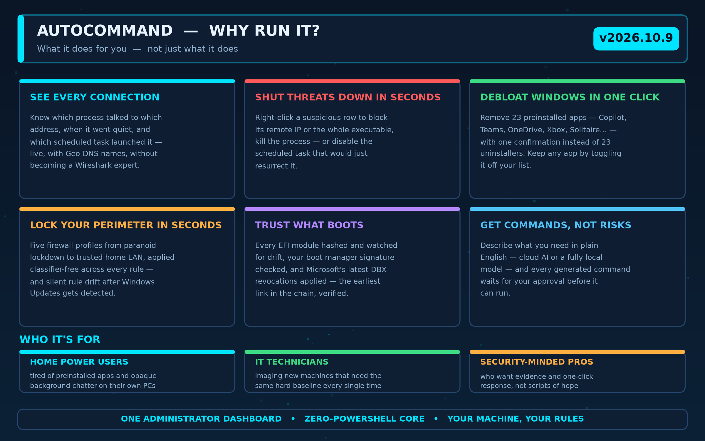

# AutoCommand — take back control of your Windows PC


**AutoCommand** is a free, open-source security and hardening dashboard for Windows 10 and 11, built for people who want to *know* what their PC is doing — and change it with one click. It watches every network connection in real time, strips out preinstalled bloat, locks the firewall down in seconds, guards the boot chain, and answers your questions with an AI that never runs anything you didn't approve.

> **⬇ Download:** grab the latest self-contained build from the [Releases page](https://github.com/dparksports/autocommand-windows/releases) — no .NET installation required. Unzip, run as Administrator, done.
>
> **🔧 Curious what's under the hood?** Every technology mentioned below is explained in the [**Technical Notes**](docs/TECHNICAL_NOTES.md).

---

## Why AutoCommand?

Windows gives you pieces of this — Task Manager, Settings, Firewall CPL, uninstallers, Event Viewer — scattered across a dozen tools that don't talk to each other. AutoCommand puts the whole picture on one administrator dashboard and turns the scary parts into single clicks:



In concrete terms, here is what that means the first week you run it:

* **You finally see who's phoning home.** Every remote address on your machine, mapped to the process behind it, the packets it moved, and — when it's a scheduled task — the exact task that launched it. Rows keep their name and full path even after the process exits, so "mystery PID" hunts are over.
* **A suspicious connection costs you one right-click to stop** — block the IP, block the executable, kill the process, or disable the scheduled task that would resurrect it tomorrow morning at 3 a.m.
* **A new Windows install loses its bloat in one confirmation, not an afternoon.** Twenty-three preinstalled apps (Copilot, Teams, OneDrive, Xbox, Solitaire, …) removed in one sweep — and if you actually use one of them, you toggle it off *your* list and it never gets touched again.
* **"Am I compromised?" becomes a five-second check, not a research project.** Firewall profiles from full lockdown to home-LAN, UEFI boot files hashed and watched, kernel-debug and SSTP tunneling guards that put themselves back if something re-enables them.
* **You stop copy-pasting commands from forums.** Describe what you want in plain English — the assistant drafts the command, shows it to you, and only runs it when you approve. It can run fully offline on your own GPU/CPU if you'd rather not touch the cloud.

---

## What it does for you, module by module

### 👁 See everything on your network — and stop it with one click


Live visibility without packet-analysis skills: Sysmon events and a raw-socket sniffer feed one self-updating grid, sorted most-recent-traffic-first automatically. Active conversations are obvious; rows idle for 5+ minutes fade. Reverse-DNS names resolve in the background, so you read `tracker.example.com`, not `142.250.74.14`. When something needs to stop: right-click → block, kill, ignore, or inspect the scheduled task behind it — the reliable "disable task" included.

**Benefit:** you notice the odd chatter *and* end it in the same minute, with evidence logged to CSV.

### 🧹 Debloat Windows once — and keep the list yours


One button scans for 23 preinstalled apps, shows you exactly what it found, and removes them after a single confirmation. OneDrive — a Win32 app invisible to the normal package manager — is detected and removed through its own uninstaller. The classic `mstsc.exe` is an OS component and is deliberately never offered. Don't agree with the defaults? Every row has a toggle, and a **Manage List** dialog lets you flip any default, add your own apps, or add patterns with a live preview of what they'd catch. Your list persists in plain JSON.

**Benefit:** a clean machine in one minute — that stays clean on the next reinstall, because Fresh Setup replays the same list.

### 🔒 Lock your perimeter in seconds — and know if it drifts


Five profiles for real situations: **Shield Up** (paranoid lockdown), **Public Strict** (travel), **Gaming**, **Office**, **Home**. Each applies across every firewall rule over native COM — no PowerShell, no group-policy surgery — with a live progress bar and a per-group report of what changed. When Windows Update or a reboot silently re-enables rules, drift detection tells you.

**Benefit:** coffee-shop Wi-Fi without second-guessing whether File Sharing is off.

### ⚡ Set up a new PC the safe way — once


A 7-step hardening plan (device-level WAN Miniport/KDNET removal, Shield Up, telemetry off, IPv6 + UAC strictness, launch-at-logon, the bloatware sweep, hibernation off) applied from one page with one master confirmation — and every step then *verifies itself* against live system state, so the page doubles as a hardening status dashboard.

**Benefit:** the same trusted baseline on every machine you touch, provably applied.

### 🚨 Catch tampering the moment it happens — and put it back

* SSTP tunneling interfaces and kernel-debug adapters are detected on arrival *and* on re-enable.
* A reconciliation sweep re-asserts the safe state every few seconds: SSTP service stopped and disabled, kernel debug off, no KDNIC adapter.
* The Hosts file is watched for malicious redirects; privileged scheduled tasks (non-Microsoft, highest run level) are surfaced for review.
* Auto-mitigate handles drift in the background, or asks first — your choice, persisted.

**Benefit:** persistence tricks that survive reboots get noticed and neutralized without you camping on Event Viewer.

### 🔐 Trust what boots

Every `.efi` module on the EFI System Partition is hashed and compared against your baseline; the boot manager's signature is verified with Sysinternals sigcheck (auto-downloaded only after SHA256 *and* Microsoft Authenticode checks pass); and Microsoft's latest DBX revocations can be applied with one explicit, warned click.

**Benefit:** boot-chain integrity stops being a whitepaper and becomes a green checkmark.

### 🤖 Get answers without giving up control


Ask in plain English ("why is svchost talking to that IP?", "block this vendor's telemetry"). The assistant drafts commands with the page's live context in mind and waits for your approval — always. Choose the Gemini cloud or a fully local GGUF model; the local path works air-gapped.

**Benefit:** an expert second opinion that can act, but only with your signature.

---

## 🆕 What's New in v2026.10.9

* **23-app bloatware sweep** with OneDrive support (Win32 removal via its own uninstaller, winget fallback).
* **Your bloatware list is yours** — per-row toggles and a Manage List dialog (defaults on/off, custom apps, custom patterns with preview), persisted as a delta so future updates still ship new defaults.
* **True recency sorting in the Process Monitor** — the grid live-sorts most-recent-packet-first and header clicks sort the real timestamp, not the display text.

Full history on the [Releases page](https://github.com/dparksports/autocommand-windows/releases).

---

## 📋 Requirements

* **OS**: Windows 10 (v2004+) or Windows 11
* **Runtime**: none for the release build (self-contained); .NET 10 SDK to build from source
* **Privileges**: Administrator — required for WMI events, SetupAPI device removal, firewall COM, and UEFI variable writes

## 🔨 Build & Run

```powershell
git clone https://github.com/dparksports/autocommand-windows.git
cd autocommand-windows

dotnet build --configuration Release
Start-Process -FilePath "bin\Release\net10.0-windows10.0.19041.0\AutoCommand.exe" -Verb RunAs
```

Self-contained package (Linux `.so` files are stripped automatically):

```powershell
dotnet publish -c Release -r win-x64 --self-contained true
```

Regenerate the README infographics (Python 3.10+, `matplotlib`, `numpy`):

```powershell
py Assets/generate_infographics.py
```

## 🔧 Technical Notes

**What powers all of this?** In one paragraph: a **zero-PowerShell core** — firewall automation over the `INetFwPolicy2` COM API with indirect group names resolved via `SHLoadIndirectString`; device and tamper defense over WMI instance events, `SetupAPI` P/Invoke, and the Service Controller; connection visibility from Sysmon's `EventLogWatcher` plus a raw `SIO_RCVALL` socket (no WinPcap); app inventory and removal through `Windows.Management.Deployment`; UEFI integrity via SHA256 baselines, Authenticode (`WinVerifyTrust`) tool gating, and `Set-SecureBootUEFI`; and AI through Gemini or local GGUF models via `LLamaSharp` — every generated command gated behind explicit approval.

The full breakdown — subsystem tables, design rules, the one documented PowerShell exception, and every file the app writes to disk — lives in [**docs/TECHNICAL_NOTES.md**](docs/TECHNICAL_NOTES.md).

---

## ⚠️ Responsible Use

AutoCommand modifies live firewall rules, services, boot configuration, and UEFI Secure Boot variables. Use it only on machines you own or are authorized to administer, and understand what each profile does before applying it — **Shield Up** in particular disables most of the rule set by design.

## 📄 License

Licensed under the [Apache License, Version 2.0](LICENSE).
