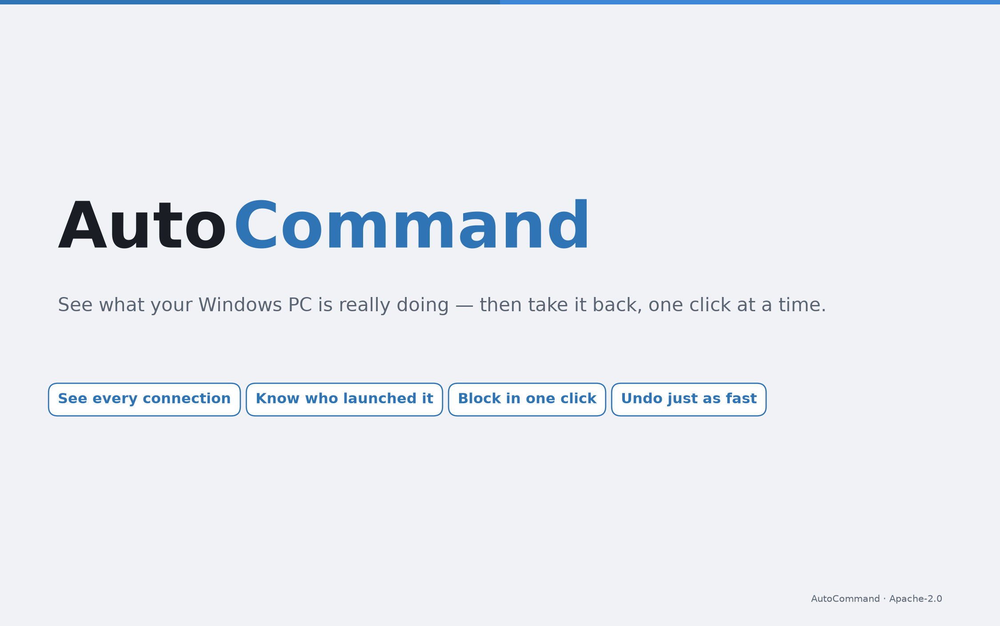
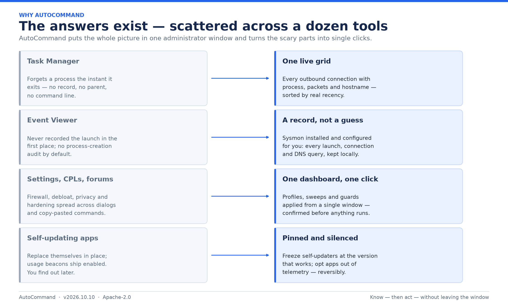
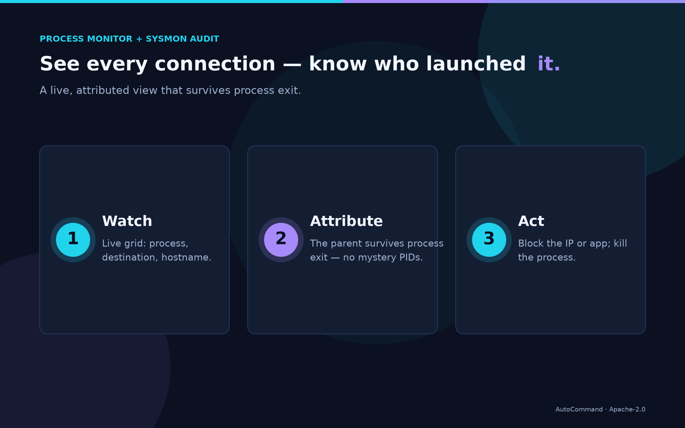
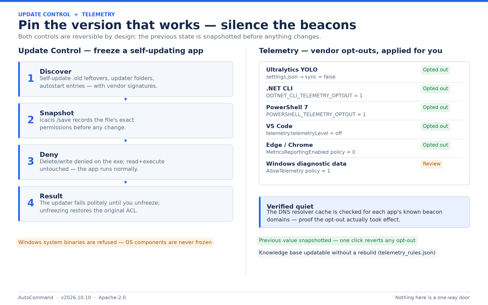
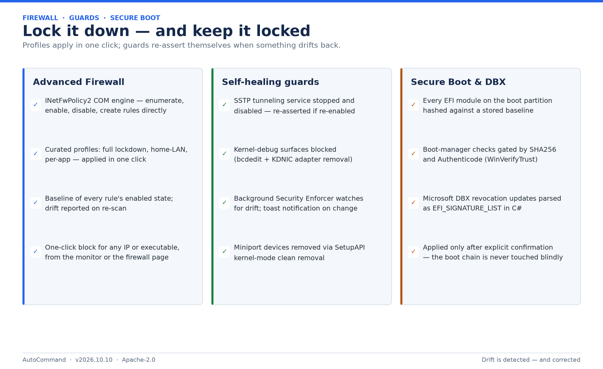
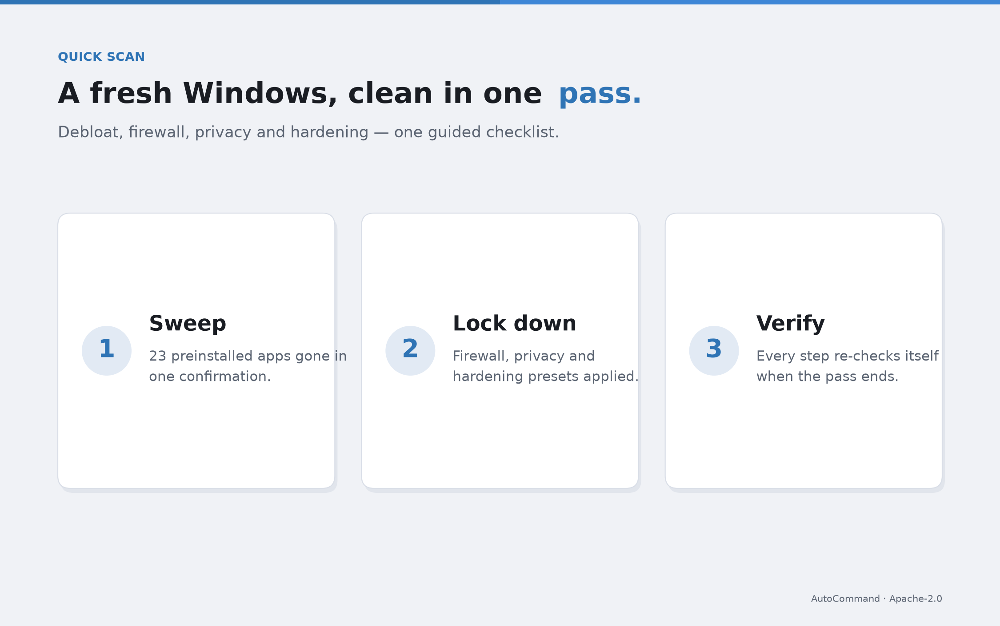

# AutoCommand — see what your Windows PC is really doing, then take it back with one click



**AutoCommand** is a free, open-source security and control dashboard for Windows 10 and 11. It runs as one administrator window where every question that normally costs you an afternoon — *what is this process, who launched it, where is it connecting, how do I make it stop, why does my PC phone home, what updated itself last night?* — becomes a row in a table, a colored status card, or a single button.

> **⬇ Download:** grab the latest self-contained build from the [**Releases page**](https://github.com/dparksports/autocommand-windows/releases) — no .NET installation required. Unzip, run `AutoCommand.exe` as Administrator, done.
>
> **🔧 Under the hood:** every technology mentioned below is documented in the [**Technical Notes**](docs/TECHNICAL_NOTES.md) — what runs, what it touches on disk, and why. Licensed Apache 2.0.

---

## Why it exists

Windows spreads the answers across a dozen tools that don't talk to each other. AutoCommand puts the whole picture in one place and turns the scary parts into single clicks:



Concretely, the situations it is built for:

* **A mystery process is sending packets to a server you don't recognize.** Find it by PID or destination, read which process owns it and what launched it — even if the process already exited — then block the IP, block the executable, kill the process, or disable the scheduled task that would resurrect it tomorrow at 3 a.m.
* **You want a record, not a guess.** Install Sysmon from the app in one click, and from then on every process launch (full command line and parent), every network connection and every DNS query is recorded locally — so "what was that?" becomes a lookup instead of forensics.
* **An app keeps replacing itself** and you want it pinned at the version that works. Freeze it: the app keeps running, its updater fails politely, and unfreezing restores the original permissions exactly.
* **Libraries and apps silently beacon usage statistics.** See which installed software has telemetry on, apply the vendor's own documented opt-out with the previous value snapshotted, and verify the beacons actually stopped.
* **A fresh Windows install needs an afternoon of cleanup.** Debloat 23 preinstalled apps in one confirmation, lock the firewall down, remove kernel-debug surfaces, guard the Secure Boot chain — and skip the steps for the things you actually use.

---

## What you get, tab by tab

### 👁 Process Monitor + 🧭 Sysmon Audit — every connection, attributed



A live, self-updating grid of outbound connections fed by Sysmon events and a raw-socket sniffer (no WinPcap/Npcap needed), sorted most-recent-traffic-first: a row jumps to the top the moment new packets arrive, and rows silent for 5+ minutes fade so active conversations stand out. Reverse-DNS runs in the background — you read hostnames, not IPs.

The part Windows cannot do: **attribution that survives process exit.** Short-lived helpers (spawned scripts, one-shot updaters, `taskhostw.exe` DLL hosts) are named, pathed, and tied to the scheduled task that launched them — including *which DLL* a COM-handler task actually executes, and a flag when that DLL no longer exists (classic leftover of uninstalled software). The **Sysmon Audit** tab keeps the record: one status card (service state, channel health, events per 24 h, active config hash) with Install / Repair / Apply-Config buttons, and a live feed of every process launch with its full command line and parent — backfilled from the log when you open the tab, so the answer survives hours later.

Right-click any row to block its IP or executable in the firewall, kill the process, or inspect/disable the task behind it. Everything exports to CSV.

### ❄ Update Control + 📊 Telemetry — pin versions, silence beacons



**Update Control** discovers self-updating apps on your machine (self-update `.old` leftovers, updater folders, autostart updaters) with their vendor signatures. Freezing one snapshots its permissions (`icacls /save`) and then denies delete/write on the executable: the app runs normally, its updater fails until you unfreeze, and unfreezing restores the original ACL exactly. Windows-signed system binaries are refused outright.

**Telemetry** scans installed software against a knowledge base of known telemetry senders (Ultralytics YOLO, .NET CLI, PowerShell 7, VS Code, Edge, Chrome, Windows diagnostic data — updatable without a rebuild). Each row shows the on/off state with the exact evidence, applies the **vendor's own documented opt-out** (a settings key, environment variable or policy — never a firewall hack), keeps the previous value snapshotted so one click reverts it, and verifies via the DNS resolver cache that the beacons actually stopped. The first row of that table is ours: AutoCommand's own telemetry is opt-in.

### 🛡 Advanced Firewall + 🔒 OS Hardening + ✅ DBX Safety — lock it down, keep it locked



Curated firewall profiles (full lockdown, home-LAN, per-app) applied in one click over the `INetFwPolicy2` COM engine, with a baseline of every rule's enabled state and drift reporting. Self-healing guards stop and disable SSTP tunneling and kernel-debug surfaces — and re-assert themselves if something drifts back, with toast alerts. The Secure Boot chain is hashed and watched: every EFI module against a stored baseline, boot-manager checks gated by SHA256 + Authenticode, and Microsoft DBX revocation updates parsed and applied only after explicit confirmation.

### 🧹 Default Apps + 🚀 Fresh Setup — a new PC, cleaned in one pass



Twenty-three preinstalled apps (Copilot, Teams, OneDrive, Xbox, Solitaire, Feedback Hub, …) removed in one sweep — OneDrive through its own Win32 uninstaller, Store apps through the deployment engine, and classic OS components like `mstsc.exe` deliberately never offered. Every row carries a **＋ Bloatware / ✓ Bloatware** toggle and a Manage-List dialog, so if you actually use one of them, it never gets touched again; your list persists machine-wide as a delta over the defaults. **Fresh Setup** runs the whole first-hour ritual — debloat, firewall lockdown, privacy, hardening — as one guided pass with per-step verification.

### Also on board

📋 **Tasks** (full Task Scheduler control), 🚀 **Startup** entries, 🌙 **Hibernation** posture, ⚙ **Settings** — and a status bar that always tells you whether the background Security Enforcer is active.

---

## What AutoCommand will not do

* **Nothing runs without you.** Removals, applies, freezes and DBX updates all confirm first; AI-generated commands are displayed for approval.
* **Non-removable means non-offered.** System-signed OS components never appear in the bloatware list, and Windows binaries are never frozen by Update Control.
* **No hidden state.** Everything the app remembers is readable JSON/text on disk, listed at the end of the [Technical Notes](docs/TECHNICAL_NOTES.md). Its own telemetry is opt-in and off unless you say yes.

## Build from source

```powershell
# .NET 10 SDK required
git clone https://github.com/dparksports/autocommand-windows.git
cd autocommand-windows
dotnet build AutoCommand.csproj -c Release

# self-contained build (what the releases ship)
dotnet publish AutoCommand.csproj -c Release -r win-x64 --self-contained
```

Run the published `AutoCommand.exe` as Administrator — WPF, .NET 10, Windows 10 (19041+) / Windows 11.

## Contributing & license

Issues and PRs welcome — pick a tab, keep the design rules in the [Technical Notes](docs/TECHNICAL_NOTES.md) (zero-PowerShell core, explicit confirmation, verified downloads), and match the existing code style. Apache License 2.0.
