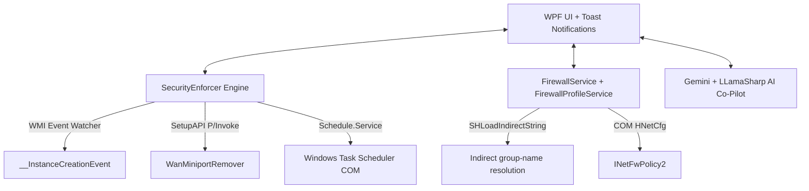

# AutoCommand v3.5.1 🛡️


**AutoCommand** is an enterprise-grade C# WPF security and OS hardening suite for Windows 10 and 11. It delivers zero-PowerShell threat monitoring, event-driven network adapter defense, native COM firewall management with one-click profiles, and an integrated conversational AI co-pilot — all from a single administrator dashboard.

---

## 🆕 What's New in v3.5.1

* **🎛️ Five One-Click Firewall Profiles** — *Shield Up*, *Public Strict*, *Gaming*, *Office*, and *Home* presets apply curated rule-group changes from the Advanced Firewall Settings page, powered entirely by native `INetFwPolicy2` COM.
* **🔤 Indirect Group-Name Resolution** — Windows returns firewall groups as indirect resource strings (`@FirewallAPI.dll,-32752`). AutoCommand now resolves them to display names (`Network Discovery`) via `SHLoadIndirectString` and matches case-insensitively, so profile presets hit the rules they claim to hit.
* **📊 Transparent Profile Application** — applying a profile shows live per-group progress, disables the controls for the duration, then reports a per-group *matched / changed / failed* summary (including the first error on failure) and auto-refreshes the rules grid.
* **📋 Enabled-First Rules View** — the rules list re-sorts on every load so enabled rules and their groups appear at the top.
* **📦 64% Smaller Packages** — Windows publish output strips Linux `.so` native libraries, shrinking the release package from 460 MB to 167 MB.
* **🛠️ Telemetry Fixes** — Firebase telemetry JS-injection sanitization, `engagement_time_msec` handling, consent sync, and SurfaceBrush dropdown fixes.

---

## 🖥️ The Suite at a Glance


---

## 🎛️ Advanced Firewall Management

The **Advanced Firewall Settings** page gives you full read/write access to Windows Defender Firewall without a single line of PowerShell.

### Quick Profiles

| Profile | What it does | Intended for |
|---|---|---|
| **Shield Up** | Disables every grouped rule, then re-enables only the whitelists (`mDNS`, `Core Networking`) | Suspected compromise, full lockdown |
| **Public Strict** | Disables File & Printer Sharing, Network Discovery, Remote Desktop | Public Wi-Fi, travel |
| **Gaming** | Enables Network Discovery, Cast to Device functionality | Gaming / streaming on a trusted LAN |
| **Office** | Enables File & Printer Sharing, Network Discovery, Remote Desktop | Office workstation on a LAN |
| **Home** | Enables File & Printer Sharing, Network Discovery | Trusted home network |


### How a profile applies

1. **Enumerate** — every rule is read through `INetFwPolicy2` COM.
2. **Resolve** — indirect group strings are translated to display names (`SHLoadIndirectString`).
3. **Match** — group matching is case-insensitive against both the raw and the resolved name, so no rule is missed.
4. **Apply** — group-by-group changes run with a live progress bar; controls are locked for the duration.
5. **Report** — a completion dialog lists matched / changed / failed rules per group (with the first error, if any), and the grid auto-refreshes with enabled rules first.

Beyond profiles, the page supports per-rule toggling, group-wide enable/disable, and **Save to Config** overrides that the [Security Enforcer](#️-event-driven-security-enforcer) uses for drift detection. The whole rule context is exposed to the AI co-pilot via `IAiAuditable` for natural-language audits.

---

## 🛡️ Event-Driven Security Enforcer

* **SSTP & WAN Miniport Guard** — detects unauthorized Remote Access Service (RAS) tunneling interfaces instantly.
* **Kernel Debug Adapter Block** — intercepts active `KDNIC` / kernel debug network adapters used for remote OS debugging.
* **Event-Driven WMI Defense** — native `__InstanceCreationEvent` / `__InstanceDeletionEvent` subscriptions fire the moment an unauthorized adapter appears, with zero idle CPU cost.
* **Privileged Task Scanner** — enumerates non-Microsoft scheduled tasks running with `TASK_RUNLEVEL_HIGHEST` privileges.
* **Hosts File Guard** — real-time detection of malicious DNS redirects outside `localhost` / `127.0.0.1`.
* **Action Center Toast Alerts** — native Windows 10/11 toast notifications bring AutoCommand to the foreground on click.
* **Auto-Mitigation Toggle** — choose automatic background takedowns or interactive review prompts (Block, Whitelist, Ignore). Whitelists and preferences persist across reboots.

---

## 🧠 AI Security Co-Pilot

* **Gemini Cloud Assistant** — natural-language chat in the Command Panel to audit configurations and safely execute system tasks.
* **Local Offline LLM** — integrated `LLamaSharp` runtime runs GGUF models directly on CPU or CUDA 12, no cloud required.
* **Guarded Actions** — suggested changes are confirmed before execution; firewall state is packaged for the model via the `IAiAuditable` interface.

---

## 🌐 System & Process Analytics

* **Sysmon Integration** — native monitoring of `Microsoft-Windows-Sysmon/Operational` via `EventLogWatcher`, plus an installer service.
* **Active Connections & Geo-DNS** — live remote IPs, process bindings, and reverse-resolved domain names.
* **Raw Socket Sniffer** — packet-level visibility without WinPcap dependencies.
* **SVCHOST Monitor** — per-service breakdown of the generic host processes.
* **1-Click Firewall Block** — block an executable's inbound and outbound traffic instantly via `INetFwPolicy2`.

---

## 🔒 OS Hardening & UEFI Integrity

* **DBX Firmware Safety Check** — Authenticode validation and UEFI DBX revocation checks on system bootloaders.
* **Hardening Toggles** — quick controls for LSA Protection, UAC enforcement, telemetry, WiFi Direct, and hibernation.
* **SetupAPI Device Takedown** — direct P/Invoke `SetupAPI` routines (`WanMiniportRemover.cs`) for clean kernel-mode adapter removal — no `pnputil` CLI.

---

## 🧩 Extras

* **Plugin System** — extend AutoCommand through the bundled `AutoCommand.Sdk` plugin loader.
* **Default Apps Manager** — per-extension and per-protocol association control.
* **Scheduled Tasks & Startup Managers** — inspect and control persistence points.
* **Telemetry Dashboards** — opt-in Firebase-backed usage analytics with local sanitization.

---

## 🏗️ Architecture



AutoCommand uses a **Zero-PowerShell Core** architecture. All monitoring and mitigation features interact directly with Windows C/C++ subsystem APIs, WMI COM interfaces, and P/Invoke DLLs (`iphlpapi.dll`, `setupapi.dll`, `shlwapi.dll`), eliminating overhead and avoiding script execution policies.

### Project layout

```
Views/      WPF pages (Firewall, Connections, Hardening, Plugins, …)
Services/   COM / WMI engines (FirewallService, SecurityEnforcer, …)
Helpers/    Config managers and process runners
Models/     Shared data models
Sdk/        AutoCommand.Sdk plugin SDK
Assets/     README infographics + generator script
```

---

## 📋 System Requirements

* **OS**: Windows 10 (v2004+) or Windows 11
* **Runtime**: .NET 10 SDK (or self-contained deployment)
* **Privileges**: Administrator rights (required for WMI events, SetupAPI device removal, and COM firewall configuration)

---

## 🔧 Build & Run

```powershell
# Clone repository
git clone https://github.com/dparksports/AutoCommand.git
cd AutoCommand

# Build (Release)
dotnet build --configuration Release

# Launch with Administrator privileges
Start-Process -FilePath "bin\Release\net10.0-windows10.0.19041.0\AutoCommand.exe" -Verb RunAs
```

Optional — build a self-contained release package (Linux `.so` libraries are stripped automatically):

```powershell
dotnet publish -c Release -r win-x64 --self-contained true
```

Optional — regenerate the README infographics (requires Python 3.10+ with `matplotlib`):

```powershell
py Assets/generate_infographics.py
```

---

## ⚠️ Responsible Use

AutoCommand modifies live Windows Firewall rules and OS security settings. Use it only on machines you own or are authorized to administer, and understand what each profile does before applying it — **Shield Up** in particular disables most of the rule set by design.

---

## 📄 License

Licensed under the [Apache License, Version 2.0](LICENSE).
